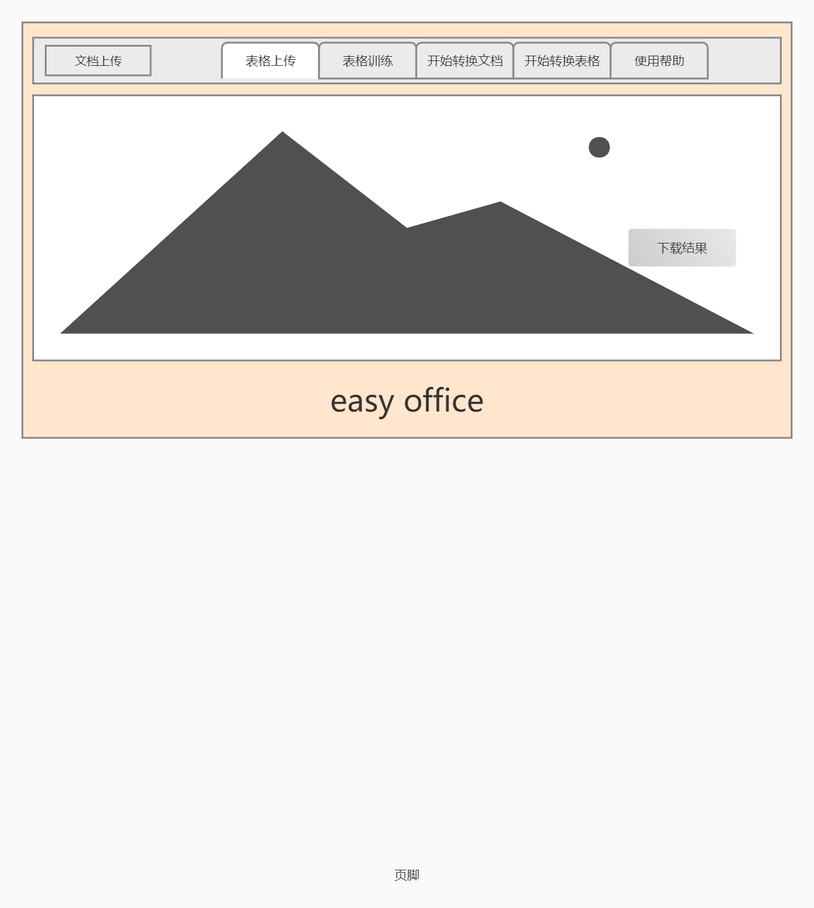

# 问题描述:

- 给定照片，提取照片中的文字，并输出到指定文件。

- 给定手写表格，提取中的文字，并形成电子表格。

# 要求：

- 支持win7及以上电脑。内存占用较小。
- 启动快，稳定。有详细的日志，分级别，对人友好。
- 使用简单，有提示。一个问题的解决不可以超过五步。
- 识别率高。可以支持多种输出方式。输出对人友好。
- 安装简单，与windows普通软件安装一致。或者一键启动。

# 难点：
- 照片可能会有拍摄不清。
- 照片拍摄可能只是部分。
- 表格中的文字大多是手写。手写的字体五花八门。
- 表格格式各不相同。
- 表格中可能会出现照片。

# 功能

- 用户可以选择图片上的某些字段
- 用户可以指定输出文件格式以及文件内容格式。
- 用户只需要导入有编号图片集合。
- 输出的一个整篇的文档。
- 用户输入包含表格的图片集合。
- 输出一个包含整个表格的集合。
- 表格中的图片居中。
- 表格中的某些字段提取。
- 表格中的文字转换为文档。
- 表格训练窗口。

# 原型图

